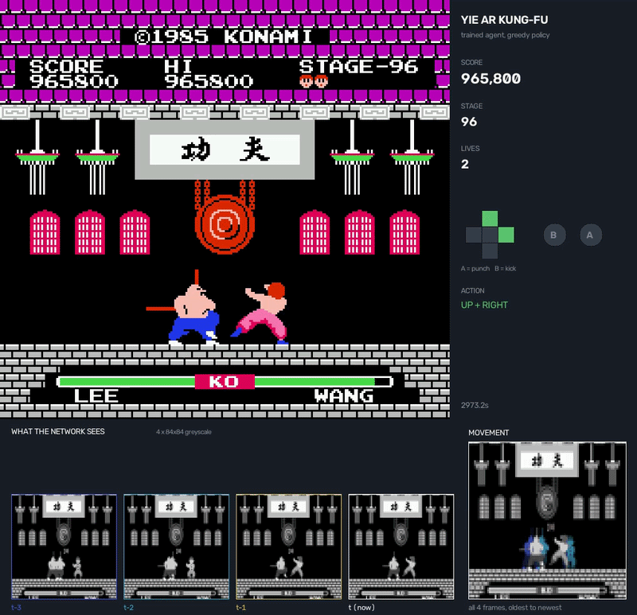
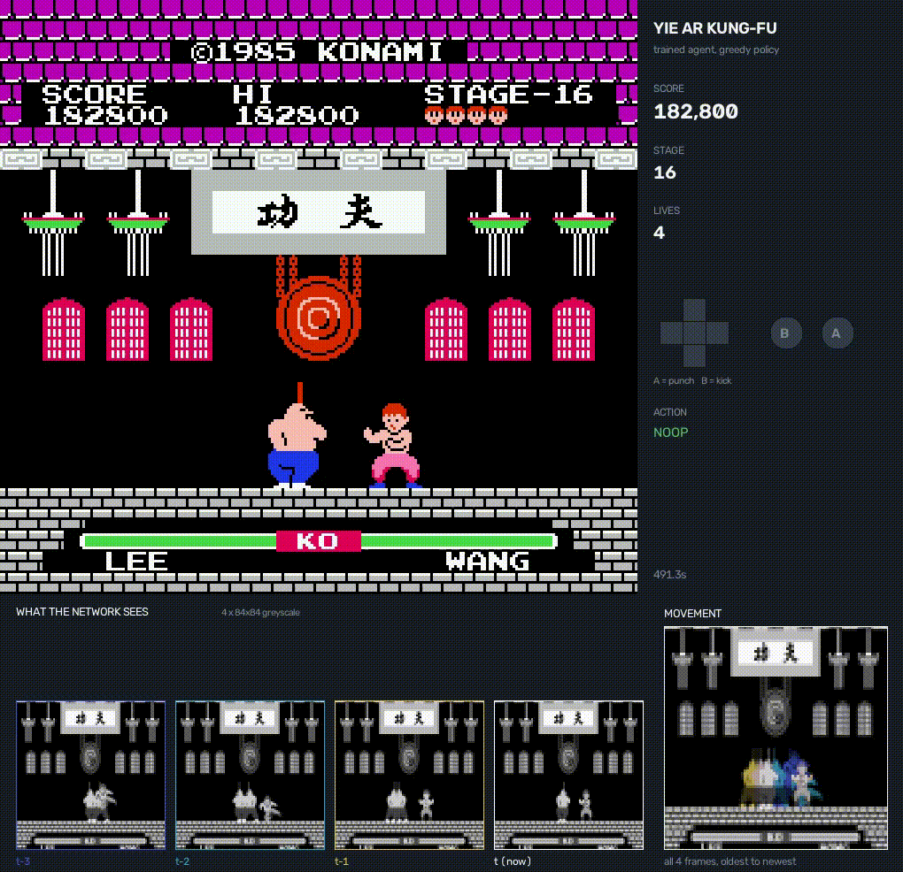
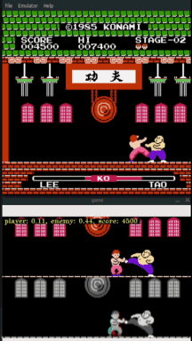

# AI Kung-Fu

A deep RL agent that learns to play **Yie Ar Kung-Fu (NES)** from raw pixels.

The agent never reads emulator memory. It sees the framebuffer, and its reward is
extracted from the same pixels a human looks at — score digits, health bars, the
stage counter, the lives icons. Emulator RAM is touched in exactly one place: an
offline calibration tool that *verifies* the computer-vision pipeline is reading
the screen correctly. Nothing under `envs/` or `rl/` imports it.

<table>
<tr>
<td width="33%"></td>
<td width="33%"></td>
<td width="35%"></td>
</tr>
<tr>
<td><b>2026</b> — stage 99+, agent won game</td>
<td><b>2025</b> — <= stage 21</td>
<td><b>2021</b> — stalled at ~stage 5.</td>
</tr>
</table>

*Recorded with `make demo`, which also writes an MP4 with the game audio.*

**The current agent plays until the game runs out of numbers.** In a single
uncapped life it cleared **116 stages in 61.7 minutes for ~1,162,400 points**,
rolling the two-digit stage counter past 99 back to 1 and the six-digit score
past 999,999 back to zero. It was not beaten by a stage; it exhausted the HUD.

> An independent, non-commercial research project. Not affiliated with or
> endorsed by Konami or Nintendo, and no ROM is distributed — see
> [Disclaimer](#disclaimer). The 2021 implementation is preserved under
> [`legacy/`](legacy/).

---

## Timeline

**2021 — first attempt** Screen-scraped a Nestopia window, injected keystrokes,
vanilla DQN. Stalled at roughly **stage 5** and stayed there. Four silent bugs,
none of them a hyperparameter: a broken MDP, an action set with no punch, a
21 GB replay buffer, and a reward paid once per animation frame. Nothing could
measure whether the vision was even reading the screen correctly, so all four
looked identical — a flat reward curve*.

**2025 — rewrite.** Synchronous headless emulator, 17 actions, Double/Dueling
DQN with n-step and prioritised replay, and a calibration harness that proves
the CV pipeline works before a single training step. **Stage 21**, 10M steps,
~4.5 h on one GPU.

**2026 — past the wall.** 10M steps of training hit a hard ceiling at stage 21
and stopped dead: 20 of 20 evaluation episodes ended there, never at 22. The fix
was not a hyperparameter. It was measuring *where* the agent died, discovering
it had almost never trained at the stage that killed it, and seeding episodes
there. 6M more steps with a start-state curriculum: **116 stages, ~1,162,400
points**, until the game's own counters wrapped.

## Results

| | 2021 | 2025 | 2026 |
|---|---|---|---|
| **Stages cleared** | ~5 | 21 | **116** |
| **Score** | — | 240,200 | **~1,162,400** |
| Survival | — | ~13 min | **61.7 min** |
| Ended because | — | lost at the stage-21 wall | stage + score counters wrapped |

Greedy, uncapped, one complete life. `Yie Ar Kung-Fu (Japan) (Rev 1.4)`, sha1
`d07be428…`.

> **Always evaluate with `--endless`.** Every capped number in this project has
> understated the agent. A 6,000-step cap scored the 2025 agent at stage 13–14
> when it really reached 21; the 20,000-step cap used during the 2026 run reports
> `eval/score_mean` of 413,550 at stage 43, because **every** eval episode hit
> the ceiling still alive (`eval/steps_mean` came out at exactly 20,000.0). The
> uncapped run is nearly 3× that. `make eval NAME=run1 ARGS=--endless`

### How it got there

| | 2021 | 2025 |
|---|---|---|
| Frame source | screen-scrape a Nestopia window (`mss`) | `stable-retro` framebuffer, synchronous |
| Action ↔ result | async queues that **dropped frames** | causally linked, deterministic, seeded |
| Throughput | ~100 fps | 2,209 emu fps/env; ~617 agent steps/s on 8 envs |
| Control | `pynput` key injection into a live window | emulator button vector |
| Action space | 7, **no punch**, held-B kick fires once | 17 combinations, press/release implicit |
| Algorithm | vanilla DQN, MSE loss | Double + Dueling + 3-step + PER, Huber |
| Replay, 200k transitions | **21.3 GB** (never fit) | **1.41 GB** |
| HUD read accuracy | unknown, unmeasurable | **100%** over 1,871 live frames |
| Config | `consts.py` globals | validated pydantic + YAML |
| Resume | never (`load_models` was never called) | automatic |
| Tests | 0 | **88** |
| Platform | Linux only (`wmctrl`, `os.killpg`) | WSL2 / Linux / macOS |

Still pixels-only. Still no RAM in the loop. That part was always the good idea.

---

## How the stage-21 wall fell

This is the part worth reading. The jump from 21 to 116 stages came from
**measurement, not tuning** — no change to the network, the optimiser, the
reward, or any hyperparameter that a sweep would have touched.

### The game is five fights in a loop

Reading the opponent name out of a recording, stage by stage:

| stages | backdrop | opponents |
|---|---|---|
| 1–5 | red | WANG, TAO, CHEN, LANG, MU |
| 6–10 | blue | WANG, TAO, CHEN, LANG, MU |
| 11–15 | green | WANG, TAO, CHEN, LANG, MU |
| 16–20 | white | WANG, TAO, CHEN, LANG, MU |
| 21+ | red again | WANG, … |

There are **five opponents and four backdrops**. Stage 21 is WANG on red —
the same fight as stage 1, only faster. There is no new content after stage 20
and no ending: the game loops forever, getting quicker each time. "Beating" it
can only mean surviving deeper, which is why every cap in this project lies.

### Stage 21 was not hard, it was unvisited

Attributing every life lost to the stage it was lost on, over 20 uncapped games:

| stage | opponent | lives lost per visit |
|---|---|---|
| 1–15 | all five | 0.00 – 0.05 |
| 16 | WANG | 0.30 |
| 17, 18 | TAO, CHEN | 0.00 |
| 19, 20 | LANG, MU | 0.15 |
| **21** | **WANG** | **3.20** |

**64 of 80 total deaths happened on stage 21**, and 20 of 20 games ended there.
The agent walked through stages 1–20 nearly untouched and then lost every life
it had to one fight.

The cause was exposure, not difficulty. Reaching stage 21 from a cold start takes
~11,000 agent steps, and the agent then dies within ~1,000. Across 10M steps of
training, **well under 1% of experience was at the fight that ended every game.**
A controlled check — the same opponent at three difficulty tiers, all from full
health with three lives — made it plain:

| start | first-fight win rate | stages cleared |
|---|---|---|
| stage 1 WANG | 100% (12/12) | 20.0 |
| stage 16 WANG | 100% (12/12) | 5.0 |
| **stage 21 WANG** | **0% (0/12)** | **0.0** |

### The fix: seed episodes where the agent dies

`tools/make_stage_states.py` drives a trained checkpoint through the game and
snapshots the emulator on first arrival at each target stage. Those savestates
become `env.start_states`, sampled by weight, so an episode can *begin* at the
frontier instead of spending 11,000 steps travelling there:

```yaml
env:
  start_states:
    - {name: Level1,  weight: 1.0}   # keeps stages 1-15 from rotting
    - {name: Stage16, weight: 1.5}   # the same WANG fight, one loop slower
    - {name: Stage19, weight: 0.5}
    - {name: Stage20, weight: 0.5}
    - {name: Stage21, weight: 5.0}   # 59% of episodes start at the wall
```

The weights are the measured death rates. Nothing else changed. The wall fell
between step 10.75M and 11.25M — `eval/stage_max` jumped 21 → 36 in a single
evaluation interval, then kept climbing to 43 before the cap stopped reporting.

### Why this generalises: a self-improvement cycle

The frontier moves, so the curriculum has to move with it:

1. Train until `eval/stage_max` plateaus.
2. Find where the lives are actually going (per-stage death attribution).
3. Snapshot savestates at that frontier — `make_stage_states.py --stages 40 42 44`.
4. Re-weight `start_states` by the measured death rate, resume, repeat.

Each turn of the loop is cheap because it resumes from the previous checkpoint
rather than starting over. This is the "self-improvement cycle" the project was
always aiming at, with a *measured* frontier instead of a guessed one.

### Two things that did not matter

Worth recording, because both looked promising and both cost a full training run:

- **Bigger observations.** 94×150 instead of 84×84 scored 166,130 against the
  baseline's 163,800 — inside the noise. The bottleneck was never spatial detail.
- **PPO.** On identical budget it trailed DQN throughout. The replay buffer earns
  its keep here: fights are rare, expensive events worth revisiting.

One thing that looked decisive and wasn't: stage 21 is *pixel-identical* to
stage 1 in greyscale (backdrop luminance 62.9 vs 63.0 — and loop 5 reuses loop
1's exact palette, so colour would not help either). That predicts the agent
blindly replays its stage-1 policy. It does not: the action distributions differ,
and the network values stage 21 far lower (mean Q 8.19 vs 12.23). It could tell
it was in trouble; it simply had no trained response. A hypothesis that survives
three good arguments and dies to one measurement is the normal case here.

---

## Requirements

- **Windows:** WSL2 + Ubuntu. `stable-retro` has no native Windows build, but CUDA
  passes through to WSL2 and the source lives on the Windows filesystem, so you
  edit from Windows and train in WSL.
- **Linux / macOS:** works directly.
- Python 3.11–3.13, NVIDIA GPU strongly recommended.
- A legally-obtained ROM. **None is distributed here**; `roms/*.nes` is gitignored.

Verified on Ubuntu 26.04 (WSL2), Python 3.12, torch 2.14+cu126, stable-retro
1.0.1, gymnasium 1.3.0.

For `torch.compile`, WSL also needs a C compiler (Triton builds kernels with it):
`sudo apt install build-essential`. Without one the trainer says so and runs
eager — it no longer dies mid-run.

---

## Setup

```bash
make install                      # uv venv + editable install with CUDA torch
cp "/path/to/Yie Ar Kung-Fu.nes" roms/
make rom                          # register a custom stable-retro integration + savestate
make calibrate                    # dump HUD regions, harvest digit glyphs
#   -> label out/glyphs/labels.json (ten glyphs, once)
make atlas
make check                        # must report ~100% HUD readability
```

Yie Ar Kung-Fu is **not** among stable-retro's 298 NES integrations, so `make rom`
builds one: `rom.sha`, an inert `scenario.json` (Python owns reward and
termination), and a savestate booted to the first fight.

`make check` is not ceremony. A misread HUD produces a reward signal that is
quietly noise, and that is indistinguishable from "the agent has not learned
yet" — which is exactly how the original hid four separate bugs for years.

---

## Training

```bash
make smoke                        # 40k steps, ~3 min, proves the pipeline end to end
make go NAME=run1                 # train AND watch live, one command; Ctrl+C stops both
make tb                           # TensorBoard at :6006 (separate terminal)
```

`make go` runs training in the foreground and the live mosaic on
**http://localhost:8080**. WSL2 forwards localhost, so that URL works from a
Windows browser with no X server. `NAME` is shared by `go`, `watch`, `demo` and
`eval`, so they always point at the same run. Knobs: `PORT=`, `WATCH_ENVS=`,
`CONFIG=`.

Separate processes instead:

```bash
make train NAME=run1              # terminal 1
make watch NAME=run1              # terminal 2, attaches to a run already going
```

Runs auto-resume from the newest checkpoint, so stopping and restarting loses
nothing.

### Watching it learn

- **Live mosaic** (`tools/watch.py`) — a separate playback process that reloads
  the newest checkpoint every 30s and streams a grid of games as MJPEG. Costs
  training nothing; leaving it open shows the policy changing over the run.
- **TensorBoard** — `eval/score_mean`, `eval/score_max`, `eval/stage_max` and
  `eval/steps_mean` are the honest exploration-free numbers. Optimiser tags are
  prefixed by algorithm: `dqn/loss`, `dqn/q_mean`, `dqn/td_error`,
  `dqn/grad_norm`, `dqn/beta` (or `ppo/*`). `episode_end/{gameover,stall,time_limit}`
  is the one to check when scores plateau — it says *how* episodes are ending.
  **Watch `eval/steps_mean`**: if it equals `max_episode_steps` exactly, every
  eval episode is being cut off alive and the score is a floor, not a result.
- **Console** every 10k steps: fps, mean return, epsilon, episodes, best score.

Watch `eval/score_mean`, not training return — training return is entangled with
the epsilon schedule and with reward shaping.

### Episode length

`max_episode_steps` (default 6,000) and `stall_timeout` (600) live **in the env**,
so they apply to the viewer and the demo too, not just training. That is why a
long run appears to jump back to stage 1. Short episodes are good for training —
they keep the replay buffer diverse — but for watching you usually want:

```bash
make watch NAME=run1 ARGS=--endless    # play until the agent actually loses
make eval  NAME=run1 ARGS=--endless
```

`make demo` already passes `--endless`. Both tools print the active cap on
startup, so it is never silently in play.

There are **three** independent limits and conflating them is easy:

| flag | lifts | controls |
|---|---|---|
| `--endless` | `max_episode_steps` + `stall_timeout` | when the **game** ends |
| `--episodes N` | the `--seconds` duration | when **filming** stops |
| `--max_seconds 0` | the 3,600 s safety stop | the **hard ceiling** on filming |

A 60-second recording of an uncapped episode still stops after 3,600 frames, and
`--endless --episodes 1` alone still stops after an hour. To record a genuinely
unbounded game, you need all three:

```bash
make demo NAME=run1 ARGS='--max_seconds 0'
```

---

## Evaluating and demoing

```bash
make eval NAME=run1 ARGS=--endless   # greedy episodes, uncapped
make demo NAME=run1                  # one full game -> out/run1-demo.mp4, live at :8081
```

`make demo` records **one complete game**, start to death — over an hour for the
current agent — and **streams what it is recording** to http://localhost:8081
while it works, at true game speed. A demo always begins at stage 1: any
`start_states` curriculum in the checkpoint's config is ignored and the tool says
so on startup, since otherwise a "full game" recording would silently begin two
thirds of the way in. Use `--start_state Stage21` when you deliberately want to
film the frontier. The live preview is silent — MJPEG carries no audio — but the
MP4 has the game sound. Add `ARGS=--no-realtime` to render it in ~90 s instead
of real time, `--no-live` to skip the preview, `--episodes 3` for several games.

It produces a presentation-quality MP4 containing:

- **Real game audio**, 32 kHz stereo, muxed with ffmpeg.
- **A NES pad overlay** — D-pad and A/B light up on every press, with the action
  named, so you can see what the agent is doing rather than only the result.
- **What the network sees** — the exact tensor it receives: four 84×84 greyscale
  playfield crops, labelled `t-3 … t (now)`.
- **A MOVEMENT screen** — those same frames colour-coded oldest-to-newest and
  max-blended. Static scenery appears in all four so it reads white; anything
  that moved leaves a coloured trail. This is the 2021 "3 frames as RGB channels"
  idea generalised to a 4-deep stack, and it makes visible the one thing a single
  frame cannot tell you: whether a leg is extending or retracting.

Audio is deliberately only in `make demo`; the live viewer and the periodic
training eval clips stay silent.

---

## Layout

```
src/kungfu/
  config.py                validated config; every former magic number, with units
  emulator/integration.py  registers the ROM with stable-retro, builds a savestate
  vision/
    atlas.py               exact 8x8 tile OCR for HUD digits
    hud.py                 frame -> GameStats (score, stage, health, lives, game over)
    oracle.py              RAM ground truth -- CALIBRATION ONLY, never in training
  envs/
    kungfu.py              Gymnasium env: pixels in, CV reward out
    actions.py             17 button combinations
    reward.py              proportional, telescoping reward shaping
    wrappers.py            channel stacking, episode stats
  rl/
    registry.py            ENCODERS / ALGOS registries; build_agent(cfg, ...)
    networks.py            encoder + head composition, legacy checkpoint migration
    heads.py               dueling Q head, actor-critic head
    encoders/              nature_cnn, impala -- swappable via config
    algos/                 dqn.py, ppo.py behind one Agent interface
    buffers/               replay.py (n-step, prioritised), rollout.py (GAE)
  train.py / evaluate.py
tools/
  calibrate_vision.py      dump / harvest / build-atlas / check
  make_stage_states.py     snapshot savestates at deep stages for the curriculum
  discover_ram.py          locate RAM addresses empirically, for the oracle
  watch.py                 live mosaic of many games, MJPEG to a browser
  demo.py                  MP4 with audio, pad overlay, vision + movement screens
  mjpeg.py                 shared MJPEG-over-HTTP streaming used by both
legacy/                    the 2021 implementation, kept for comparison
```

---

## Status

- [x] Synchronous, deterministic, headless, parallel environment
- [x] Vision pipeline verified at 100% HUD readability
- [x] Modern DQN with auto-resume and honest evaluation
- [x] Live viewer, demo recorder, 88 tests
- [x] Beat the 2021 result (~5 levels → stage 21, 240,200 points)
- [x] Get past the stage-21 wall (start-state curriculum)
- [x] 50+ levels — **116 stages, ~1,162,400 points, counters wrapped**
- [x] Race PPO against the DQN (DQN won on equal budget)
- [x] Survive a second counter wrap (stage 99+)
- [x] Automate the curriculum loop end to end

---

## References

- Mnih et al. 2015, *Human-level control through deep reinforcement learning*
- van Hasselt et al. 2016, *Deep RL with Double Q-learning*
- Wang et al. 2016, *Dueling Network Architectures*
- Schaul et al. 2016, *Prioritized Experience Replay*
- Hessel et al. 2018, *Rainbow*
- Machado et al. 2018, *Revisiting the ALE* (sticky actions)
- Maxim Lapan, *Deep Reinforcement Learning Hands-On* — the original reference
  for this project

## Disclaimer

This is an independent research and educational project, built to study computer
vision and reinforcement learning. It is **not affiliated with, authorised by,
sponsored by, or endorsed by Konami or Nintendo**, or any of their subsidiaries
or affiliates.

*Yie Ar Kung-Fu* is a trademark of Konami Digital Entertainment Co., Ltd.
*Nintendo Entertainment System*, *NES* and *Famicom* are trademarks of Nintendo
Co., Ltd. All game titles, characters, artwork, audio and other assets remain
the property of their respective owners. They are referenced here only to
identify the software this agent was evaluated against.

**No ROM or game code is distributed with this project.** `roms/*.nes`,
`integrations/*/rom.nes` and `*.state` are all gitignored, so nothing derived
from the cartridge is committed. To run anything here you must supply your own
copy of the game, obtained legally, and you are responsible for complying with
the laws of your jurisdiction.

Besides original source code, the repository contains only a SHA-1 checksum of
the ROM — used to verify your dump matches the one the HUD coordinates were
calibrated against — and two short gameplay clips
([`resources/preview.gif`](resources/preview.gif),
[`resources/preview_2025.gif`](resources/preview_2025.gif)) included to
illustrate the technical write-up. If you are a rights holder and would prefer
those clips removed, open an issue and they will be taken down.

Nothing here is offered for commercial use, and the project has no connection to
any commercial product or service.

## Licence

The code in this repository is MIT licensed (see [LICENSE](LICENSE)). The licence
covers **this project's own source code only** — it does not extend to the game,
its ROM, or any third-party assets referenced above.
